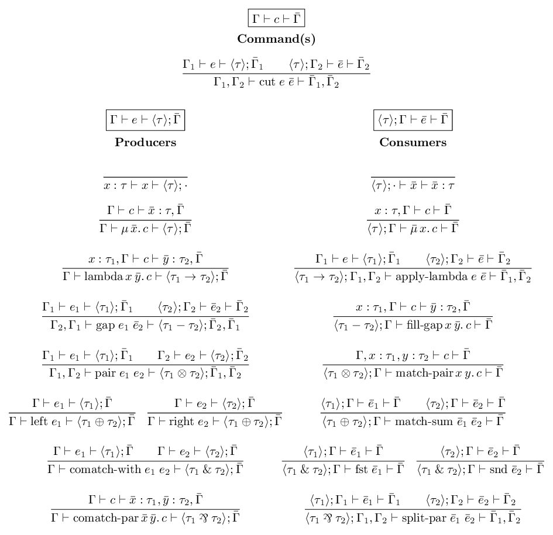
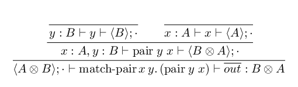

# System L

A type-checker for [System L](https://www.youtube.com/watch?v=0Qg_RnSHyhU), a linear lambda calculus with _two_ contexts, like in [the Dual calculus](https://homepages.inf.ed.ac.uk/wadler/papers/dual/dual.pdf). The left context contains the assumptions, as usual, and when one of those assumptions is in focus then the term is a consumer which matches on a value of that type. The right context contains the conclusions, and when one of those conclusions is in focus then the term is a producer which constructs a value of that type. I still don't have a good intuition for what it means for a term to have more than one conclusion.

## Syntax


## Typing Rules  


## Examples

### Swap Function


The derivation trees for this language are very verbose, so for succinctness, let's omit the `cut` rules.



[Here is the code](https://github.com/gelisam/system-l/blob/b58400c2a839d2a19ad63b06a276b802eac6fbec/src/Examples.idr#L191-L202) for the `swap` program:

```idris
uconsume "in"
  (UMatchPair "x" "y"
    (uproduce "out"
      (UPair
        (UVar "y")
        (UVar "x"))))
```

[The type checker infers](https://github.com/gelisam/system-l/blob/b58400c2a839d2a19ad63b06a276b802eac6fbec/src/Examples.idr#L204-L210) that the left context is `in : Ten A B` and that the right context is `out : Ten B A`.

### Curry Function


[Here is the term](https://github.com/gelisam/system-l/blob/b58400c2a839d2a19ad63b06a276b802eac6fbec/src/Examples.idr#L332-L346) for `curry`:

```idris
uproduce "a2b2c"
  (ULam "a" "b2c"
    (uproduce "b2c"
      (ULam "b" "c"
        (uconsume "ab2c"
          (UApp
            (UPair (UVar "a") (UVar "b"))
            (UCoVar "c"))))))
```

[The type checker infers](https://github.com/gelisam/system-l/blob/b58400c2a839d2a19ad63b06a276b802eac6fbec/src/Examples.idr#L348-L354) that the left context is `ab2c : Ten A B -> C` and that the right context is `a2b2c : A -> B -> C`.
