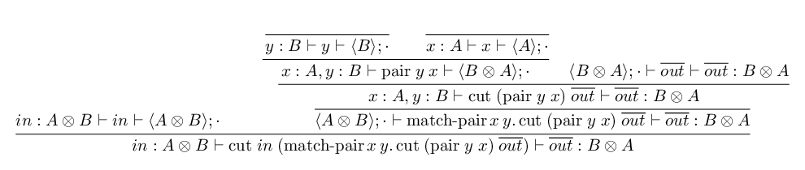
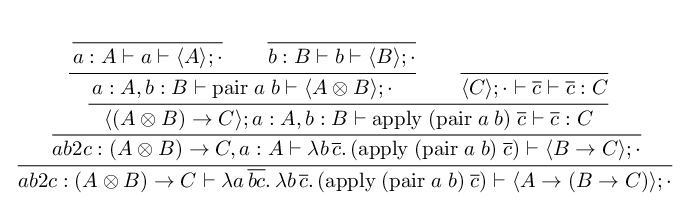

# System L

A type-checker for [System L](https://www.youtube.com/watch?v=0Qg_RnSHyhU), a linear lambda calculus with _two_ contexts, like in [the Dual calculus](https://homepages.inf.ed.ac.uk/wadler/papers/dual/dual.pdf). The left context contains the assumptions, as usual, and when one of those assumptions is in focus then the term is a consumer which matches on a value of that type. The right context contains the conclusions, and when one of those conclusions is in focus then the term is a producer which constructs a value of that type. I still don't have a good intuition for what it means for a term to have more than one conclusion.

## Syntax

## Typing Rules  

## Examples

### Swap Function

### Curry Function

